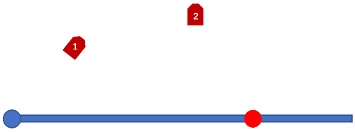

## 0 概述

智能运动体测仪，是一款面向体育竞赛、中学，高校体测的智能体侧系统，它基于计算机视觉技术，运用神经网络模型动态识别受试人员的姿态特征，计算其速度，追踪其位置变化信息，用于计量多项体育测试的成绩，且搭载人脸识别技术，智能记录成绩入库。通过分析受试者在测试过程中的姿态动作，给予其改进的建议，帮助其提升成绩，并对有运动损伤风险的动作予以矫正。  
它有着体积小，操作简单，精度高，保证公平公正等优点。

## 1 方案分类
关于体测系统实现的设计，主要有两种方案，分别为脱机式运算和联网运算方案，前者依托于高性能本地主机，需要插电工作，后者则依赖高速网络和强大的服务器，可由电池驱动，体积小，便携。

### 1.1 脱机运算方案

#### 1.1.1 概述
本地主机通过无线信号接受来自采集设备的视频流信号，并实时计算成绩，将数据存入本地数据库，并在联网后自动备份至服务器，通过服务器可查询，统计信息。

#### 1.1.2 服务器
##### 功能
- 存储数据库
- 提供所有数据的在线管理，查询，统计服务
- 收集本地主机与采集设备的运行情况，以及时提供故障检修和技术支持
##### 配置

|硬件名称    | 要求   |
| :-------: |:--------:| 
|CPU	|16核 主频2.5GHZ+
|内存	|32GB
|硬盘	|1T SSD(存储约2W人4项常规体侧信息)
|带宽	|100M+（供40人在线观看体侧视频）
|硬盘吞吐量	|125MB/S
|租用价格|3W5/年
-----------------------------------
#### 1.1.3 本地主机
##### 功能
1.	搭载WIFI，供采集设备连接，接收视频流信号
2.	根据视频流计算得到体测成绩
3.	提供近期体侧数据的本地查询，统计服务
4.	搭载一套采集设备，用于信息采集
##### 配置

- 同时处理5台设备传回视频流数据

|硬件名称    | 要求   |备注| 
| :-------: |:--------:| :--------:| 
|硬盘	|4T机械 250G固态
|内存	|32GB
|CPU	|I7-10700K
|显卡	|二路1080TI|11GB显存*2
|电源	|1500W
|WIFI模块	|能在150M距离实现200M带宽低延迟传输
|操作显示设备|	触摸屏显示与操作
|电商价|2W5内

-------------------------------------
- 同时处理10台设备传回视频流数据

|硬件名称    | 要求   |备注|
| :-------: |:--------:|  :--------:|
|硬盘	|4T机械 250G固态
|内存	|64GB
|CPU	|I9-10900X
|显卡	|四路1080TI|11GB显存*4
|电源	|2000W
|WIFI模块	|能在150M距离实现200M带宽低延迟传输
|操作显示设备|	触摸屏显示与操作
|电商价|4W内

-------------------------------

- 同时处理20台设备传回视频流数据

|硬件名称    | 要求   | 备注|
| :-------: |:--------:| :--------:|
|硬盘	|4T机械 250G固态
|内存	|128GB
|CPU	|I9-10900X
|显卡	|四路RTX TITAN|12GB显存*4
|电源	|2000W
|WIFI模块	|能在150M距离实现200M带宽低延迟传输
|操作显示设备|	触摸屏显示与操作
|电商价|10W内

#### 1.1.4 采集设备
##### 功能
- 采集体测中的图像及相关信息
- 通过WIFI向本地主机实时传输信息
- 显示体测人的姓名，成绩等
##### 配置

|硬件名称    | 要求   |
| :-------: |:--------:| 
|摄像头	|RDB-D摄像头（RGB 1080P D 720P 刷新率90HZ）
|WIFI模块	|能在150M距离实现20M带宽低延迟传输
|电源	|40W（快速充电）
|电池	|4000毫安时（能支持4小时以上的工作）
|显示屏	|单色显示屏，显示姓名，工作状态，成绩，等
|支架	|方便调平，3轴自由度
|估价|4000内
#### 1.1.5 优劣
##### 优点
- 检测结果可当场给出，显示在显示屏上
- 通讯流量开销较小
##### 缺点
- 由于本地主机需要进行神经网络运算，故设备开销较大

### 1.2 联机运算方案
#### 1.2.1 概述
本地主机实时将体侧中的图像信息通过5G网络传输给服务器，由服务器完成运算后存入服务器中数据库，并将结果反馈到本地主机，通过服务器可查询，统计信息。
#### 1.2.2 云计算服务器
##### 功能
- 根据视频流计算体测成绩
- 存储数据库
- 提供所有数据的在线管理，查询，统计服务
- 收集本地主机与采集设备的运行情况，以及时提供故障检修和技术支持
##### 配置	
- 可同时为20台本地主机提供云计算

|硬件名称    | 要求   |备注|
| :-------: |:--------:| :--------:| 
|硬盘	|4T SSD
|显卡	|四路TESLA T4|16GB显存*4
|带宽	|200M+（供50人在线观看记录视频或5台本地主机上传视频流）
硬盘吞吐量	|125MB/S+
|租用价格|26W/年

#### 1.2.3 本地主机
##### 功能
- 采集体测中的图像及相关信息
- 通过5G网络或WIFI网络向服务器实时传输信息
##### 配置
|硬件名称    | 要求   |
| :-------: |:--------:| 
|摄像头	|RDB-D摄像头（RGB 1080P D 720P 刷新率90HZ）
|WIFI模块	|能在150M距离实现20M带宽+低延迟传输
|5G模块	|用于通信，能满足20M带宽+低延迟传输
|电源	|40W（快速充电）
|电池	|6000毫安时（能支持4小时以上的工作）
|操作显示设备	|触摸屏，可控制设备，显示姓名，工作状态，成绩，等
|支架	|方便调平，3轴自由度
|估价|5000内
#### 1.2.4 优劣
##### 优点
- 由于本地主机无需运算，设备开销较小，体积小
- 用户只持有一种设备，即本地主机，维护简单	
##### 缺点
- 若附近无WIFI信号，则需要耗费较多的5G通信流量，使用开销大
- 服务器性能要求会随着售卖设备的增多而线性增长

## 2 平台支持

|    |    |    
| :-------: |:--------:| 
|测试平台|WIN10 64位、Ubuntu19.10 |
|预计支持平台|WIN8 64/32、WIN10 64/32、Ubuntu14 16 18 19 64位、TX2|
## 3 系统设备构成

- 采集设备，RGB-D相机  
- 计算设备，PC主机  
- 传输方式，相机可通过有线或无线向计算设备传输信息

## 4 立定跳远

### 4.1 功能

实时计算跳远成绩，测量误差为1.5CM内
实时人脸识别，通过画面中人脸信息与人脸库进行比对，可智能将成绩记入受试者名下，无需人工介入。  
全程视频记录，保障公平公正。  
可判断压线、连跳、摔倒等意外情况，提示受试者重新测试。  
可智能排除画面中非测试选手的影响，并提示其离开测试区域

### 4.2 工作流程

通过人脸识别受试者身份，建立档案。  
动态分析跳远过程中，人体的姿态特征，抓取受试者起跳与落地瞬间。  
抓取起跳线，脚尖，脚跟等关键点位置。  
根据RGB与深度图像，计算得到立定跳远成绩，并录入数据库。

### 4.3 性能指标
|测试项目        | 指标           | 备注  |
| :----------: |:-----------:| :-----:|
|实时计算跳远成绩	|是/否
|测量误差	|1.0CM内
|实时将成绩记入受试者名下 |是/否
|全程视频记录	|是/否
|判断压线、连跳、摔倒，提示重新测试	|是/否
|智能排除画面中非测试者，提示离开测试区域	|有/无
|落地后识别响应	|1S
|检测失误率 |0.01%

## 5 坐位体前屈
### 5.1功能

实时计算坐位体前屈成绩，测量精度为1MM  
实时人脸识别，通过画面中人脸信息与人脸库进行比对，可智能将成绩记入受试者名下，无需人工介入。  
全程视频记录，保障公平公正。  
可判断屈膝等不规范行为，提示受试者重新测试。

### 5.2工作流程

通过人脸识别受试者身份，建立档案。  
通过远景相机分析受试者的行为，追踪其手向前推的过程，并检测是否屈膝。  
当检测到受试者前推后，通过近景相机抓取图案，计算得到测试成绩，并录入数据库。

### 5.3 性能指标
|测试项目        | 指标           | 备注  |
| :-------------: |:-------------:| :-----:|
|实时计算坐位体前屈成绩|	是/否
|测量误差	|1.0MM内
|实时将成绩记入受试者名下|	是/否
|全程视频记录	|是/否
|可判断屈膝等不规范行为，提示重新测试|	是/否
|屈膝参数定义	|有/无
|识别响应|	1S
|检测失误率|0.01%

## 6 引体向上

### 6.1 功能
实时计量引体向上的成绩。  
可精确识别手臂是否伸直，下巴是否过杠情况。  
实时人脸识别，通过画面中人脸信息与人脸库进行比对，可智能将成绩记入受试者名下，无需人工介入。  
全程视频记录，保障公平公正。  
可判断反手握杆等不规范行为，提示受试者重新测试。

### 6.2 工作流程

通过人脸识别受试者身份，建立档案。  
识别杆子的位置。  
识别手掌的握法是正握还是反握。  
通过识别手臂伸直情况和下巴过杆情况，记录测试成绩，并录入数据库。

### 6.3 性能指标
|测试项目        | 指标           | 备注  |
| :-------------: |:-------------:| :-----:|
|实时计量引体向上的成绩|	是/否
|实时将成绩记入受试者名下|	是/否
|全程视频记录|	是/否
|精确识别手臂是否伸直，提示重新测试|	有/无
|手臂弯曲参数定义|	有/无
|下巴是否过杠情况，提示重新测试|	有/无
|判断反手握杆等不规范行为，提示重新测试|	有/无
|识别响应|	0.1S
|检测误差|一个内
|检测失误率|0.01%

## 7 仰卧起坐

### 7.1功能

实时计量仰卧起坐的成绩。  
可精确识别下肢姿势是否符合规范。  
实时人脸识别，通过画面中人脸信息与人脸库进行比对，可智能将成绩记入受试者名下，无需人工介入。  
全程视频记录，保障公平公正。

### 7.2 工作流程

通过人脸识别受试者身份，建立档案。  
识别大腿与小腿是否符合规范。  
追踪受试者动作，计量测试成绩，并录入数据库。

### 7.3 性能指标
|测试项目        | 指标           | 备注  |
| :-------------: |:-------------:| :-----:|
|实时计量仰卧起坐的成绩	|是/否
|检测误差|1个以内
|实时将成绩记入受试者名下	|是/否
|全程视频记录	|是/否
|识别下肢姿势是否违规，提示重新测试|	是/否
|膝盖弯曲角定义	|有/无
|识别响应	|0.1S
|检测失误率|0.01%

## 8 短跑测试

### 8.1 组成

短跑测试系统由三机位构成:  
- 1号机位负责检测起跑中行为是否规范，识别各跑道运动员身份。  
- 2号机位负责检测各运动员冲线时间。  
- 3号机位检测冲线运动员的身份。

### 8.2 工作场景

光照良好，无雷雨冰雹，可供8人同时测试。  
### 8.3 性能指标
|测试项目        | 指标           | 备注  |
| :-------------: |:-------------:| :-----:|
|测试项目|可满足50米跑，25米跑，100米跑，200米跑，等项目的测试|
|测试误差|小于0.03S
|实时将成绩记入受试者名下	|是/否
|全程视频记录	|是/否
|识别起跑违规，提示重新测试|	是/否
|识别跨越跑道，提示重新测试	|有/无
|识别响应	|0.1S
|检测失误率|0.01%

### 8.4 技术拆分与工时估计

|项目        | 用时           | 备注  |
| :-------------: |:-------------:| :-----:|
|现场图像采集    |          1天   |            |
|图像标定       |    3天\*   |          |
|跑道分割      |    5天   |            |
|人脸身份识别  |     3天     |          |
|起跑动作与犯规检测 |     1天     |          |
|场外人员标定      |      3天\*   |          |
|场外人员排除      |     3天    |           |
|冲线成绩计算与人脸识别 :blue_heart:  |   3天     |          |
|设备通信            |      5天+   |           |
|其他               |      2天    |           |
|总计                |  代码23天数据6天   |   |

### 8.5 长短跑时间花费变更与原因

蓝色表示为数据类工作
黄色为计算机工作时间
其他为技术性工作时间

|项目        | 用时    | 备注  |
| :----: |:----:|:----------:|
|运动人体数据集查找与下载    | 3天 |  查找运动相关数据集，解决蹲姿识别差问题，若找不到数据集需要自己制作小规模数据集，更好的相机，计算主机也能帮助改善识别
|人体检测模型重训练方法研究  | 3天  | 在保留原模型参数的基础上，提高对新数据集的适应性
|人体检测模型重训练         |  7天 |  计算机工作时间
|查找下载亚洲人面孔数据集   |  2天  | 原模型基于欧美成人，对亚裔和孩子效果差，如果没有数据集，需要自己制作小规模数据集
|人脸数据集的标定制作       |  3天 |  小批量数据标定，用于预研究
|人脸识别模型的重新训练     |  7天  | 计算机工作时间
|追踪模型的重训练方法研究   |  3天  | 保留原模型性能，提高对运动检测得适应性
|追踪数据集标定            |   3天  | 小批量数据标定，用于预研究
|追踪模型训练             |    5天  | 计算机工作时间

## 9 长跑

### 9.1 组成

长跑测试系统由四机位构成:
- 1号机位负责起跑动作与时间的检测。
- 1-4号机位负责对长跑中人员的跟踪，防止出现犯规行为。

### 9.2技术拆分与工时估计

|项目        | 用时           | 备注  |
| :-------------: |:-------------:| :-----:|
  |现场图像采集     |        1天|
  |图像标定                | 5天\*|
  |跑道分割                | 7天|
  |人脸身份标注            | 3天\*|
  |人脸身份识别算法        | 2天|
  |场外人员标定            | 1天\*|
  |场外人员排除算法        | 3天|
  |起跑动作与犯规检测      | 2天|
 | 运动中人脸识别与追踪     |7天|
  |到达记录点检测           |1天|
  |设备通信                | 7天+|
  |冲线成绩计算与人脸识别   |5天|
  |其他                    | 2天|
  |总计                       |代码37天数据9天|

### 9.3 工作场景

光照良好，无雷雨冰雹，可供40人同时测试。

### 9.4 性能指标
|测试项目        | 指标           | 备注  |
| :-------------: |:-------------:| :-----:|
|50米跑|是/否
|25米|是/否
|100米跑|是/否
|200米跑|是/否
|测量误差|0.03S内
|实时将成绩记入受试者名下	|是/否
|全程视频记录	|是/否
|识别起跑违规，提示重新测试|	是/否
|识别抄近道，提示重新测试	|有/无
|识别响应	|0.1S
|检测失误率|0.01%

## 10 实心球测试仪

### 10.1组成

实心球测试仪由计算主机和2机位组成:
- 1号机位用于检测人体动作，判断投掷动作是否符合规范
- 2号机位用于追踪实心球的运动，并计算落地点到投掷点的距离。

### 10.2 工作场景

光照良好，无雷雨冰雹。

### 10.3 性能指标
|测试项目        | 指标           | 备注  |
| :-------------: |:-------------:| :-----:|
|投掷动作检测|是/否
|实心球运动轨迹追踪|是/否
|测量精度|0.1M内
|实时将成绩记入受试者名下	|是/否
|全程视频记录	|是/否
|识别投掷时脚部越线，提示重新测试|	是/否
|识别响应	|1S
|检测失误率|0.01%

### 10.4技术拆分与工时估计

|项目        | 用时           | 备注  |
| :-------------: |:-------------:| :-----:|
|  场外人员排除        |   2天
 | 户外采集影像         |  1天
 | 数据标定            |   3天\*
 | 人体投掷姿态检测     |  1天
 | 起投线检测与犯规检测  | 2天
 | 实心球标定          |   3天\*
 | 实心球检测与追踪     |  2天
 | 实心球落地瞬间抓取   |  1天
 | 计算成绩            |   2天
 | 精确度提升         |    5天
 | 其他               |    2天
 | 总计               |      代码18天数据6天

## 11 俯卧撑测试仪

### 11.1组成

实心球测试仪由计算主机和RGB-D相机组成，相机用于检测人体姿态动作，判断动作是否符合规范，并实时计数

### 11.2 工作场景

光照良好，无雷雨冰雹。

### 11.3 性能指标
|测试项目        | 指标           | 备注  |
| :-------------: |:-------------:| :-----:|
|腰部角度| 是/否  |
|左右膝盖角度|  是/否  |
|肘关节角度|是/否
|身体与地面夹角|是/否
|测量误差|1个内
|实时将成绩记入受试者名下	|是/否
|全程视频记录	|是/否
|识别腰部坍塌，提示重新测试|	是/否
|识别响应	|0.1S
|检测失误率|0.01%

### 11.4技术拆分与工时估计

|项目        | 用时           | 备注  |
| :-------------: |:-------------:| :-----:|
|  人体姿态检测    |   1天
|  人体姿态数据采集 |  1天
 | 数据标定        |   3天\*
 | 姿态运动特征分析 |  2天
 | 犯规检测         |  1天
 | 场外人员排除   |    1天
 | 姿态分析与计数  |   1天
 | 总计            |     代码7天数据3天

## 12 立定跳远重构

### 12.1 性能指标
|测试项目        | 指标           | 备注  |
| :-------------: |:-------------:| :-----:|
|测量误差|1cm内

### 12.2技术拆分与工时估计

|项目        | 用时           | 备注  |
| :-------------: |:-------------:| :-----:|
|  采集影像       |       1天
|  数据统计与标定，毯子压平   |   3天\*
|  毯子检测                |   2天
|  起跳线检测              |   2天
|  多传感器融合             |   3天
|  人体姿态数据采集与统计分析| 2天
|  精确度提升             |    3天
|  总计                   |  代码14天数据3天
