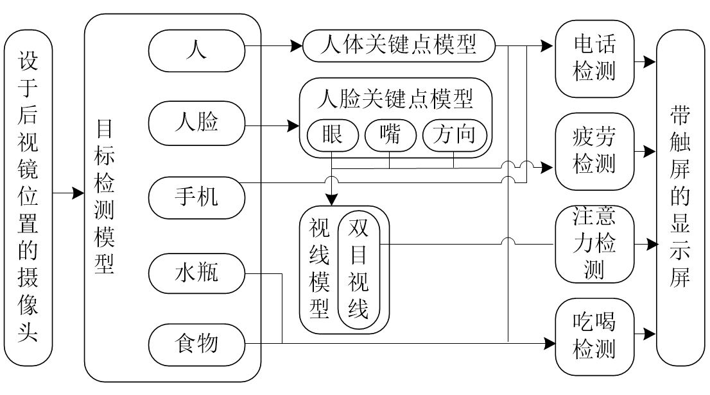

## 环境
win10
Ubuntu18
NVIDIA NANO
## 流程图

## AI模型
负责由视频分析得到原始数据
### 1-人体关键点模型
模型选择：alphapose
模型权重：使用预训练权重
输出信息：18个人体骨骼关键点位置
### 2-yolo系列目标检测模型
模型选择：yolov5 4.0
模型权重：自我训练
输出信息：目标框
检测对象：瓶子、手机、食物、卷烟、人脸、人
数据集来源：自己建立初步数据集
### 3-面部检测模型
模型选择：retinaface
模型权重：使用预训练权重
输出信息：人脸框
### 4-面部关键点检测模型
模型选择：如dlib pfld等，模型
模型权重：使用预训练权重
输出信息：人脸上68个关键点
### 5-视线预测模型
模型选择：Gaze-PFLD
模型权重：自己训练
输出信息：视线方向
## 功能模块列表
由原始数据进一步分析以实现各项功能
### 1-疲劳检测模块
由眼睛关键点、嘴巴关键点、头部方向综合决策
从闭眼、张嘴、低头等特征出发进行分析
### 2-打手机检测模块
从人体手臂关键点、手机识别框等决策
手臂保持打电话姿势、检测到手机
### 3-吃喝检测模块
从手臂关键点、嘴巴关键点、食物、水杯检测等决策
分析手臂和嘴巴的联动
### 4-抽烟检测模块
由手臂关键点、卷烟检测结果决策
手臂动作
### 5-视线偏移检测模块
由视线预测模型结果决策
## 界面设计
界面包含以下模块
- 主画面现实
- 检测结果的显示控件
- 弹出式危险警告窗口
- 过程信息展示控件
## 声音模块
用于声音报警等
## 数据集制作
### 视频采集要求
将提供200元补贴用于购买食材、饮料、手机支架，等
在静止的车内，将手机架于后视镜位置，朝向驾驶员，使摄像头可以看到驾驶者的上半身，最好能看到低头玩手机时的手机
录制16：9的1080P的如下3段视频
做如下表演 
1 吃喝抽烟篇
- 吃东西
- 用不同的杯子、瓶子喝水、喝各种饮料（如纸杯、塑料杯、饮料瓶）
- 抽烟 

2 不规范驾驶篇
- 手脱离方向盘
- 不系安全带
- 眼睛不看前方以外的各种地方，（如低头、向后看、与副驾驶交谈状、左顾右盼）
- 玩手机
- 打电话

3 表演疲劳导致的
- 眯眼睛
- 打哈切
- 小鸡啄米式的点头
- 低头睡觉

要求表演尽可能做到自然，贴切实际，充分发挥表演潜力 
如有想到其他表演内容，可以自己补充并和Leo沟通
### 数据标定
使用labelimg对视频素材中截取到的图片进行标注，存储为pascal voc格式(xml后缀) 
将图片存储在d:/driver_behavior中 
使用labelimg做如下几类物体的标记
以下格式为中文|标注名
- 人脸|face
- 人|person
- 卷烟|cigarette
- 杯子|cup
- 瓶子|bottle
- 手机|phone
- 食物|food

标记完成后将xml文件打包后发给Leo